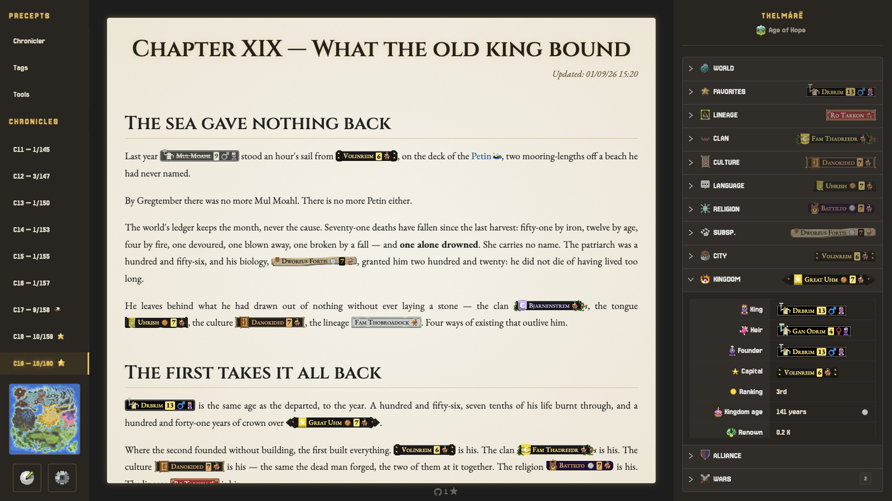

<p align="center">
  
</p>

<h1 align="center">WB Chronicler</h1>

<p align="center">Tolkien-style chronicle for <strong>WorldBox</strong> playthroughs</p>

<p align="center">
    <a href="https://github.com/Jbz797/wb-chronicler/blob/master/LICENSE"></a>
    
    
</p>

<br>

## Overview

Claude Code turns your **WorldBox** save files into narrative chapters, rendered in a parchment-themed Angular reader. The player runs the game in pure observation mode, the chronicler writes the story.

<p align="center">
  
</p>

## How it works

The player runs **WorldBox** in pure observation mode (zero intervention, sandbox laws). When a save is ready:

1. **The Chronicler** — the Claude Code CLI, run from a terminal with `src/assets/world/` as its working directory, reads the rules in `chronicler.md`, questions the world through the `tools/` commands it is given — a script per subject (`world`, `actor`, `city`, `geography`…) that decodes the `map.wbox` save (zlib-compressed JSON) and answers in JSON — browses the `map_stats.s3db` SQLite itself, and writes the next narrative chapter in a Tolkien-inspired voice (no pastiche, every claim traced back to data) — in whichever tongue `history/settings.json` records.

2. **The Reader** — an Angular SPA with NG-ZORRO and ngx-markdown displays the chapters — and, in developer mode, the rules documents — on a parchment-themed reader, with a left side nav for navigation and a right pane surfacing each chapter's stats — the world's leaderboards, the favorite character, and every body it belongs to: village, kingdom, clan, family…

Every person, town, kingdom, clan, culture and creed the prose names carries its tag — sprite, banner and colours composed from the save, so the story stays anchored to what the world actually held.

Each chapter is a self-contained folder under `saves/C<n>/` carrying its own narrative, metadata, the original save snapshot, the map preview at that moment in time, and a registry per entity kind (`cities.json`, `persons.json`, `kingdoms.json`…) recording who was who.

> **Notes**
>
> - **One save = one chapter.** The system is built around **manual saves only** — disable WorldBox auto-saves before you start. The player decides when a chapter begins and asks for it; the chronicler then works from the latest save on disk, and an auto-save would slip in an intermediate state nobody chose. Overwriting the same WorldBox slot is safe: every chapter archives the save it was built from.
> - **French or English.** One setting, `lang` in `history/settings.json`, governs both sides: the chronicler answers and writes its chapters in it, the reader's panels follow. Pick it from the settings panel, which will not save without one.
> - **Developer mode.** A second setting, `dev`, says who the reader is for. Left off — the ordinary case — the Précepte pages stay out of the nav and the chronicler delivers the chapter and nothing beside it. Turned on, the manual, the tag list and the tooling docs are there to read, and the chronicler may close on what it would see improved in the scripts or the docs.
> - **macOS, Windows and Linux.** The reader finds the WorldBox saves this machine holds, a Proton prefix on Linux included.

## State lives on disk, not in context

The chronicle runs as a **single, continuous CLI session** — `claude` left open from one chapter to the next, rather than restarted for each. Every durable piece of state is persisted to disk — the `chronicler.md` manual, the self-contained per-chapter folders, and the deterministic `tools/` extractors (a save → JSON on demand, same input → same output). Nothing that matters lives in the context window.

The model's **1M-token context window** lets that single thread run a long way before compaction is even needed. And because the filesystem holds everything durable, **compaction costs nothing** when it does happen — the conversation can be summarized as aggressively as needed and the agent simply re-grounds itself from these files. That's what makes the single-thread approach viable: more practical, and it keeps the model sharper than cold-starting.

## Requirements

- **Claude Code**, with a Claude subscription — Pro or higher is recommended, the chronicler reading, cross-checking and writing a multi-section chapter on every save
- **Node** 22+ and **Yarn** for the reader
- **Python 3** for the `tools/` extractors — the standard library, plus **Pillow** for `map/show.py` (`pip install pillow`)
- **WorldBox** (Steam) and a save to follow

## Recommended mod: Wandering Clouds

Vanilla clouds all rise on the west edge of the map, and they seed a young world's thinking peoples: its first civilizations start out crowded in the west. [Wandering Clouds](mod/), kept in this repository, lets clouds rise anywhere and drift either way, so peoples arise all over the map. Install it **before creating the world**.

## Getting started

To write the chronicle, open the chronicler in its own directory:

```sh
cd src/assets/world && claude # works inside the chronicle, ruled by `chronicler.md` alone
```

The session opens on a single order, _« Lis le chronicler.md »_ — the chronicler takes it from there.

To read it, start the reader — a separate process — on its production build:

```sh
yarn install
yarn start:prod # the reader on http://localhost:4200, a third of the dev bundle
```

On first run the reader opens its settings panel: pick the tongue the chronicle is kept in, and the save to follow among those found on this machine.

## Chronicle layout

The chronicle lives under [src/assets/world/](src/assets/world/) — full structure and conventions are documented in `chronicler.md`:

```
src/assets/world/
├── chronicler.md
├── tags.md
├── history/
├── i18n/
├── saves/
└── tools/
```

Every player's chronicle stays local to their machine — the repo carries the tooling and the manual, not the story.

## Dev

To work on the reader:

```sh
yarn start    # ng serve on http://localhost:4200, plus the saves and settings service
yarn lint:fix # ESLint, Stylelint and Prettier, auto-fixed
```

## Tech stack

- **Angular** (standalone components, signals, zoneful)
- **NG-ZORRO** (dark layout, custom gold/parchment palette)
- **ngx-markdown** + Marked + Prism.js (gruvbox-dark)
- **ngx-translate** (French and English, off WorldBox's own locale files where the game names a thing)
- **Python** for the `tools/` extractors — zlib and JSON off the save, SQLite for the history, Pillow for the map
- **TypeScript**, ESLint, Stylelint, Prettier
